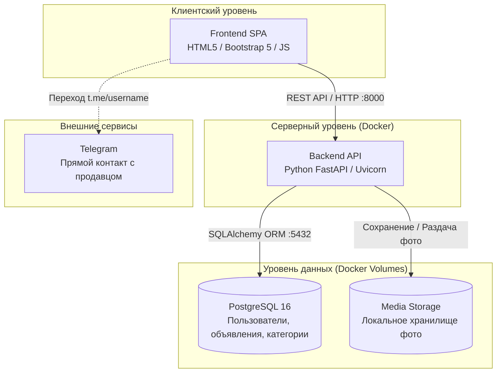

# Local Marketplace 🏪

Локальная доска объявлений для продажи, обмена и дарения вещей в студенческом кампусе.

---

## 🎯 Возможности

- **Каталог товаров** — адаптивная витрина карточек с ценами, категориями и фото.
- **Динамическая фильтрация** — фильтрация по категориям, диапазону цен и типу сделки без перезагрузки страницы.
- **Поиск** — быстрый поиск объявлений по ключевым словам.
- **Публикация объявлений** — форма добавления товара с предпросмотром фото до отправки.
- **Прямой контакт** — связь с продавцом в один клик через Telegram (`t.me/username`).
- **Личный кабинет** — просмотр своих объявлений, снятие с публикации и удаление.

---

## 🏗 Архитектура

### Общая схема системы



---

## 🛠 Технологический стек

| Компонент | Технологии |
|---|---|
| **Frontend** | HTML5, CSS3, Bootstrap 5, JavaScript (Fetch API) |
| **Backend** | Python 3.12, FastAPI, SQLAlchemy 2.0, Pydantic v2, Uvicorn |
| **База данных** | PostgreSQL 16 |
| **Инфраструктура** | Docker, Docker Compose |
| **CI / Качество кода** | GitHub Actions (Ruff Linter) |

---

## 📁 Структура репозитория

```text
local-marketplace/
├── backend/                # Серверный код (FastAPI)
│   ├── app/                # Приложение (роуты, модели, схемы)
│   ├── Dockerfile          # Сборка контейнера бэкенда
│   └── requirements.txt    # Зависимости Python
├── frontend/               # Клиентский код (HTML/CSS/JS)
├── .github/workflows/      # Автоматизация CI (проверка кода линтером)
├── docker-compose.yml      # Оркестрация сервисов (FastAPI + PostgreSQL)
├── .env.example            # Шаблон переменных окружения
├── .gitignore              # Исключения Git
└── README.md
```

---

## 🚀 Быстрый старт

### 1. Подготовка окружения
Скопируйте шаблон переменных окружения:
```bash
cp .env.example .env
```

### 2. Запуск через Docker Compose
Запуск всех сервисов (бэкенд + база данных):
```bash
docker compose up --build
```

### 📍 Адреса сервисов

| Сервис | URL | Описание |
|---|---|---|
| **Backend API** | [http://localhost:8000](http://localhost:8000) | Корневой эндпоинт API |
| **Swagger UI** | [http://localhost:8000/docs](http://localhost:8000/docs) | Интерактивная документация REST API |
| **ReDoc** | [http://localhost:8000/redoc](http://localhost:8000/redoc) | Альтернативная документация API |
| **PostgreSQL** | `localhost:5432` | Порт подключения к базе данных |
| **Frontend** | [http://localhost:5500](http://localhost:5500) | Локальный запуск через Live Server |

---

### 3. Локальная разработка бэкенда (без контейнера бэка)
Если нужно разрабатывать бэкенд локально, можно запустить только базу данных:
```bash
docker compose up -d db
```
Затем в папке `backend/` активировать виртуальное окружение и запустить сервер:
```bash
cd backend
python -m venv venv
# Windows:
venv\Scripts\activate
# Linux/macOS:
source venv/bin/activate

pip install -r requirements.txt
uvicorn app.main:app --reload
```

---

## 🌿 Правила работы с Git (Git Flow)

> ⚠️ Прямой коммит в ветку `main` закрыт. Разработка ведется строго через отдельные ветки и Pull Request.

1. Обновить `main` перед началом работы:
   ```bash
   git checkout main
   git pull origin main
   ```
2. Создать ветку под задачу:
   ```bash
   git checkout -b feature/краткое-название
   ```
3. Сделать коммит и отправить ветку на GitHub:
   ```bash
   git add .
   git commit -m "feat: краткое описание"
   git push -u origin feature/краткое-название
   ```
4. Открыть **Pull Request** на GitHub в ветку `main`.

---

## 📝 Соглашения по коммитам (Conventional Commits)

Формат сообщения: `<тип>: <описание изменений>`

| Префикс | Назначение | Пример |
|---|---|---|
| `feat:` | Новая функциональность | `feat: add user registration endpoint` |
| `fix:` | Исправление бага | `fix: resolve CORS header issue on photo upload` |
| `docs:` | Изменения в документации | `docs: update API endpoints table in README` |
| `style:` | Форматирование, отступы (без изменения логики) | `style: format python imports` |
| `refactor:` | Рефакторинг кода | `refactor: simplify database session dependency` |
| `test:` | Добавление или правка тестов | `test: add unit tests for ads search` |
| `chore:` | Изменения сборки, пакетов, конфигураций | `chore: add pillow to requirements.txt` |